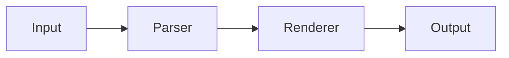

# markstream-react vs Streamdown

Both `markstream-react` and [Streamdown](https://streamdown.ai) are designed for streaming Markdown in React. They target different trade-offs.

> **Note:** Feature comparisons are based on Streamdown documentation as of the time of writing. Check [Streamdown's official docs](https://streamdown.ai) for the latest capabilities.

## Quick comparison

| | markstream-react | Streamdown |
| --- | --- | --- |
| React compatibility | React 18+, Next.js, Remix | React 18+, Next.js |
| Streaming-first | ✅ | ✅ |
| Incomplete Markdown | ✅ handles unclosed fences | ✅ |
| react-markdown drop-in | ❌ (different API) | ✅ (drop-in replacement) |
| Progressive Mermaid | ✅ | Not documented |
| Streaming code blocks | ✅ with diff tracking | Not documented |
| KaTeX math | ✅ with worker | Via remark plugins |
| Virtualized long docs | ✅ | Not documented |
| Cross-framework parser | ✅ (stream-markdown-parser) | ❌ (React-only) |
| Optional heavy peers | ✅ (install only what you need) | N/A |
| Svelte / Angular / Vue | ✅ (same parser, different renderers) | ❌ |

## When to use Streamdown

Streamdown is a **drop-in replacement for `react-markdown`** designed for AI-powered streaming. Use it when:

- You're migrating from `react-markdown` and want minimal API changes
- You need remark/rehype plugin compatibility
- Streaming is your only requirement beyond what `react-markdown` offers
- You don't need Mermaid, KaTeX workers, or long-document virtualization

## When to use markstream-react

`markstream-react` is a **streaming-first renderer with progressive heavy blocks**. Use it when:

- AI output includes Mermaid diagrams that should render progressively
- Streaming code blocks need diff tracking as content arrives
- KaTeX math should render in a Web Worker for performance
- Long AI responses (50 KB+) need virtualized rendering
- You want consistent Markdown behavior across React, Vue, Svelte, and Angular
- You need optional peer dependencies — install only what your AI output needs

## Streaming example comparison

### Streamdown

```tsx
import Streamdown from 'streamdown'

// Drop-in replacement for react-markdown
export default function ChatMessage({ content }: { content: string }) {
  return <Streamdown>{content}</Streamdown>
}
```

### markstream-react

```tsx
import MarkdownRender from 'markstream-react'
import 'markstream-react/index.css'

export default function ChatMessage({ content, isDone }: { content: string, isDone: boolean }) {
  return (
    <MarkdownRender
      content={content}
      final={isDone}
      fade={false}
    />
  )
}
```

## Progressive Mermaid: the key difference

When an LLM streams a Mermaid diagram:



**Streamdown**: renders the diagram when the fence closes. No partial rendering.

**markstream-react**: renders incremental diagram states as the Mermaid syntax arrives. Users see the diagram taking shape — better UX for long or complex diagrams.

## Choosing between them

| Your situation | Recommendation |
| --- | --- |
| Migrating from react-markdown, want minimal changes | Streamdown |
| Need remark/rehype plugin ecosystem | Streamdown |
| AI output includes Mermaid diagrams | markstream-react |
| Streaming code blocks with diffs | markstream-react |
| Long AI responses (>50 KB) | markstream-react |
| Multi-framework project (React + Vue + Svelte) | markstream-react |
| Bundle size is the primary constraint | Streamdown |
