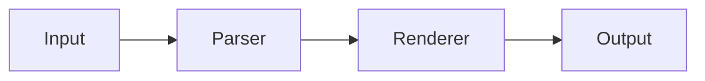

# markstream-react vs Streamdown

Both `markstream-react` and [Streamdown](https://streamdown.ai) are designed for streaming Markdown in React. They target different trade-offs.

> **Note:** Feature comparisons are based on Streamdown documentation as of the time of writing. Check [Streamdown's official docs](https://streamdown.ai) for the latest capabilities.

## Quick comparison

| Capability | markstream-react | Streamdown |
| --- | --- | --- |
| React streaming Markdown | ✅ | ✅ |
| Incomplete Markdown handling | Streaming-aware mid-state handling | Streaming-optimized |
| react-markdown-style API | ❌ different API | ✅ drop-in style |
| Mermaid | ✅ built-in Markstream integration / optional peer | ✅ via `@streamdown/mermaid` |
| Math / KaTeX | ✅ optional peer / worker-capable | ✅ via `@streamdown/math` |
| Code highlighting | ✅ Monaco/Shiki-oriented renderer, diff-aware code blocks | ✅ via `@streamdown/code` using Shiki |
| Cross-framework family | ✅ Vue/React/Svelte/Angular | ❌ React-focused |
| Long-document live-node bounding | ✅ renderer-level controls | Needs separate app-level virtualization |
| Best fit | Multi-framework AI apps, heavy blocks, long docs | React apps wanting a streaming drop-in path |

## When to use Streamdown

Streamdown is a **drop-in replacement for `react-markdown`** designed for AI-powered streaming. Use it when:

- You're migrating from `react-markdown` and want minimal API changes
- You want React-only streaming Markdown with a familiar API
- You want Streamdown's plugin model for Shiki code, Mermaid, KaTeX, or CJK support
- Long-document virtualization can stay in your application layer

## When to use markstream-react

`markstream-react` is a **streaming-first renderer with progressive heavy blocks**. Use it when:

- AI output includes Mermaid diagrams that should use Markstream's progressive heavy-block behavior
- Streaming code blocks need diff tracking as content arrives
- KaTeX math should render through Markstream's optional worker-capable integration
- Long AI responses need renderer-level live-node bounding
- You want consistent Markdown behavior across React, Vue, Svelte, and Angular
- You need both raw `content` and pre-parsed `nodes` input paths
- You need optional peer dependencies — install only what your AI output needs

## Streaming example comparison

### Streamdown

```tsx
import { Streamdown } from 'streamdown'

// Drop-in replacement for react-markdown
export default function ChatMessage({ content }: { content: string }) {
  return <Streamdown>{content}</Streamdown>
}
```

### markstream-react

```tsx
import MarkdownRender from 'markstream-react'
import 'markstream-react/index.css'

export default function ChatMessage({ content, isDone }: { content: string, isDone: boolean }) {
  return (
    <MarkdownRender
      content={content}
      final={isDone}
      fade={false}
    />
  )
}
```

## Progressive Mermaid: a key difference

When an LLM streams a Mermaid diagram:



**Streamdown**: supports Mermaid through `@streamdown/mermaid`, with interactive controls after the diagram is parsed.

**markstream-react**: renders incremental diagram states as the Mermaid syntax arrives. Users see the diagram taking shape — better UX for long or complex diagrams.

## Choosing between them

| Your situation | Recommendation |
| --- | --- |
| Migrating from react-markdown, want minimal changes | Streamdown |
| Need Streamdown's React plugin model | Streamdown |
| AI output includes progressive Mermaid-heavy answers | markstream-react |
| Streaming code blocks with diffs | markstream-react |
| Long AI responses (>50 KB) | markstream-react |
| Multi-framework project (React + Vue + Svelte) | markstream-react |
| Need `content` and pre-parsed `nodes` paths | markstream-react |
